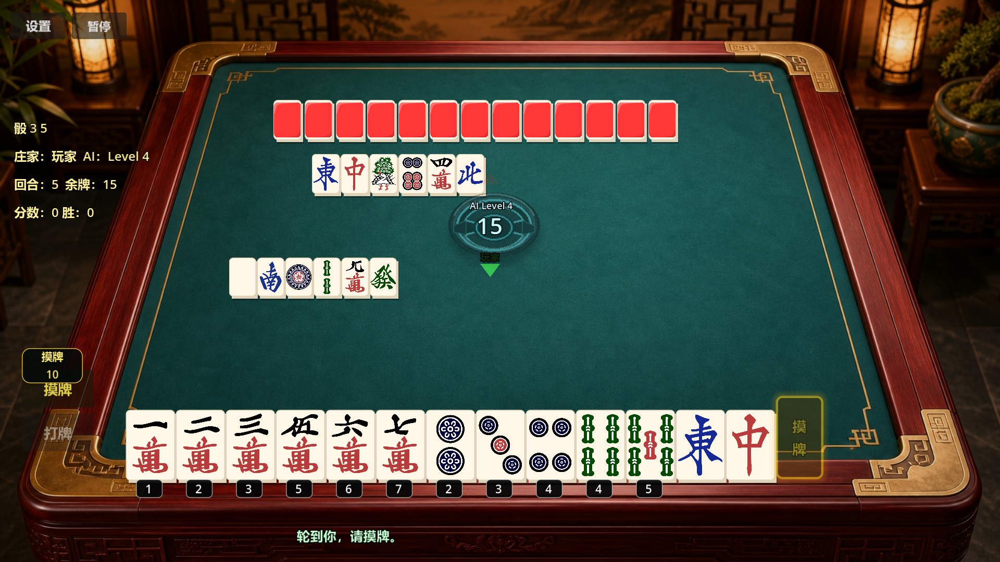

# Happy Two-Player Mahjong

A small Mahjong game I made because I often wanted to play Mahjong,
but didn't always have four people around.

Built with Godot, and designed specifically around two-player matches.

## Current Features

- Single-player against computer opponents
- AI difficulty levels 1–8
- Windows LAN two-player mode
- Chi, Pong, Kong and Mahjong
- Beginner hints and basic tutorial
- English and Chinese UI
- Multiple table themes
- Music and sound effects

## Screenshots

## Built with Godot

This project is developed with Godot.

I use this repository to share public development notes, screenshots,
updates and things I learned while making the game.

The game source code is not published in this repository.

## Play

Demo:https://oldyoungcn.itch.io/mahjong-web-trial

## Developer

OldYoung  
Solo indie game developer.
