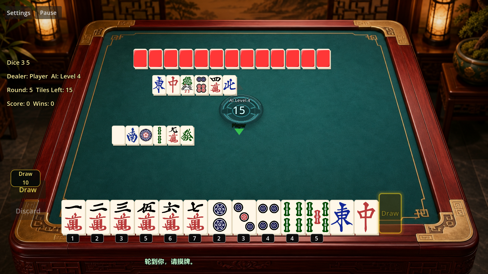
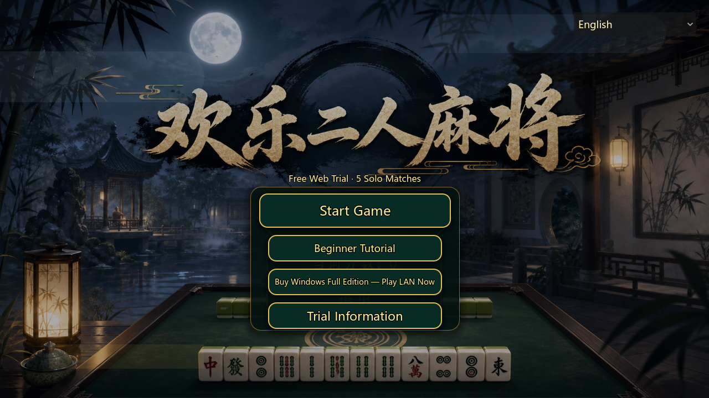
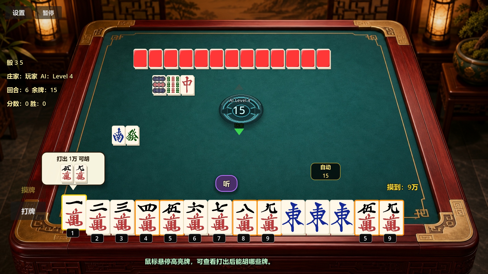
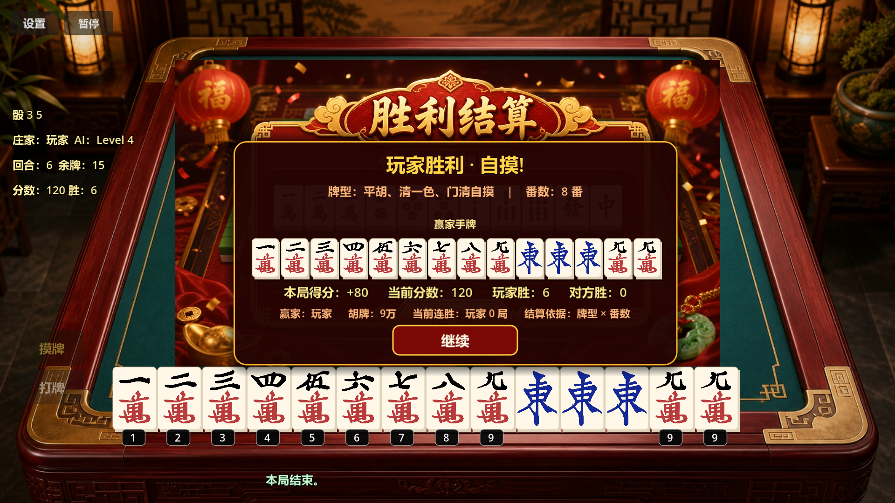

  
  &nbsp;&nbsp;
  

# 欢乐二人麻将

**Happy Two-Player Mahjong**

这是一款专门围绕二人对局设计的中文麻将游戏。

我做它的原因其实很简单：有时候想打麻将，但身边并不总是正好能凑齐四个人。

所以我没有尝试把传统四人麻将简单压缩成两个人玩，而是从一开始就围绕二人对局重新考虑牌墙、节奏、电脑对手和操作体验。

游戏使用 **Godot** 开发，目前运行于 Windows。

## 当前内容

目前游戏包含：

* 玩家对电脑单人模式
* 电脑对手 1–8 级难度
* Windows 局域网双人对战
* 64 张牌墙
* 万、筒、条
* 东、南、西、北、中、发、白
* 摸牌
* 出牌
* 吃
* 碰
* 明杠
* 暗杠
* 补杠
* 抢杠胡
* 听牌
* 胡牌
* 自摸
* 新手提示
* 基础教程
* 摸牌操作提示
* 中文 / English 界面
* 多种牌桌外观
* 背景音乐
* 游戏音效
* 音乐和音效独立音量控制
* 详细对局结算

## 为什么是二人麻将？

传统麻将通常需要四个人。

但现实里，“想打麻将”和“正好有四个人”经常不是同时发生的。

我想做一个不用凑齐四个人，也不用进入真人线上牌桌，就可以随时玩几局麻将的游戏。

因此，《欢乐二人麻将》从一开始就是围绕两个人设计的，而不是把四人麻将硬塞进二人模式。

你可以自己和电脑玩，也可以在同一个 Windows 局域网内和另一个玩家对战。

## 电脑对手

单人模式目前提供 **1–8 级**电脑难度。

我不希望所谓“高难度”只是简单地让电脑作弊，所以开发过程中一直在调整电脑的判断方式、出牌选择和不同难度之间的差异。

这部分也是我仍然会继续测试和调整的地方。

有时候 Level 8 也会让我开始怀疑，到底是谁在测试谁。

## 局域网双人对战

游戏支持 Windows 局域网双人对战。

两台电脑位于同一局域网时，可以建立并加入对局。

目前这是局域网模式，不是互联网在线匹配。

## 使用 Godot 开发

整个游戏使用 **Godot Engine** 开发。

作为个人开发者，我也会在这个仓库里记录一些开发过程中遇到的问题，例如：

* Mahjong 游戏逻辑
* 电脑玩家决策
* Godot UI
* Windows 导出
* GL Compatibility
* 局域网通信
* 性能问题
* Bug 和修复过程

有些东西可能很小，但如果刚好能帮到另一个正在用 Godot 做游戏的人，那就值得写下来。

## 关于这个仓库

这个仓库主要用于公开：

* 游戏介绍
* 截图
* GIF / Gameplay
* 版本更新记录
* 开发笔记
* 已知问题
* 一些实际开发经验

**游戏源代码不会发布在这个仓库中。**

这是一个项目展示和开发记录仓库，而不是游戏源码仓库。

## 游戏截图

截图和 Gameplay GIF 会陆续放在这里。

## itch 

https://oldyoungcn.itch.io/

## Steam / Demo

《欢乐二人麻将》正在准备：

* Steam 正式版
* Steam Demo
* Steam Early Access

Steam 页面和 Demo 链接可在正式公开后添加在这里。

## Android 封闭测试申请链接：https://play.google.com/apps/testing/com.oldyoung.mahjong2p

## 关于游戏内容

本游戏是麻将电子游戏，不涉及真钱赌博。

游戏不包含：

* 真钱下注
* 现金提现
* 付费筹码
* 与输赢挂钩的现实奖励

## 开发者

**OldYoung**

个人独立游戏开发者。

主要使用 Godot，也会尝试 AI 辅助开发以及一些不太常规的游戏开发方式。

我喜欢做一些自己觉得有意思的小型游戏。

有些项目可能很小，有些可能不会赚到什么钱，但我还是很喜欢把一个脑子里的想法慢慢做出来，然后真正把它发布出去。

## Feedback

如果你试玩了游戏，欢迎告诉我：

* 哪里的操作让你困惑
* 哪个 AI 难度感觉不合理
* 哪条麻将规则可能有问题
* UI 哪里不好用
* 有没有遇到 Bug
* 哪些提示对新手没有帮助

这些反馈通常比一句“不错”更有用。

Thanks for playing.

